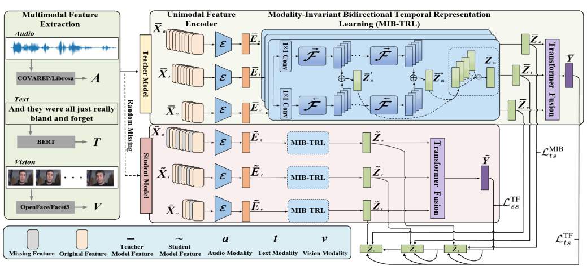
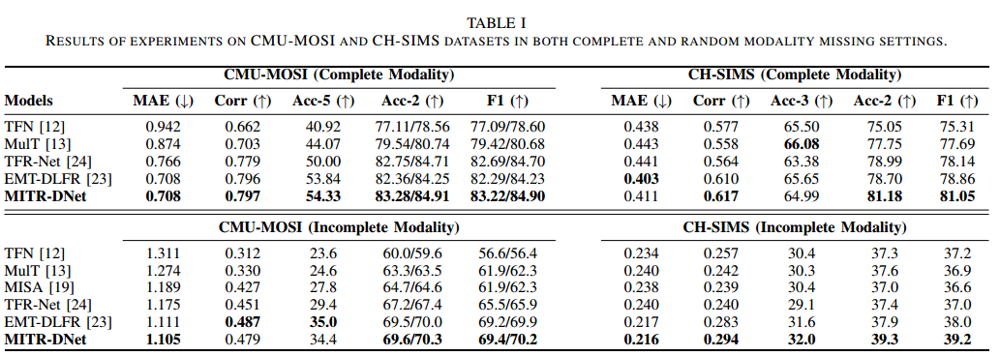
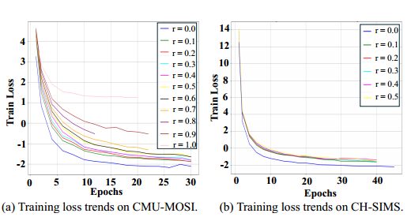
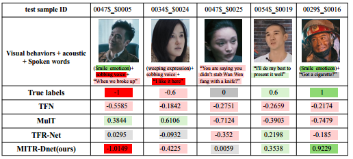

# MITR-DNet
> **Modality-Invariant Bidirectional Temporal Representation Distillation Network for Missing Multimodal Sentiment Analysis**<br>
> [Xincheng Wang], [Liejun Wang], [ Yingfeng Yu], and [Xinxin Jiao]<br>
> School of Computer Science and Technology, Xinjiang University, Urumqi, China<br>

## News
MITR-DNet Framework .<br>

## Overview




## Data Preparation
- We conduct experiments on three popular MSA datasets, including [CMU-MOSI](https://ieeexplore.ieee.org/abstract/document/7742221/), and [CH-SIMS](https://aclanthology.org/2020.acl-main.343/).
- Download pre-pocessed dataset features and pre-trained bert checkpoints from [Baidu Cloud Drive](https://pan.baidu.com/s/1oksuDEkkd3vGg2oBMBxiVw) (code: `ctgs`) or [Google Cloud Drive](https://drive.google.com/drive/folders/1E5kojBirtd5VbfHsFp6FYWkQunk73Nsv?usp=sharing) (Credits: [Self-MM](https://github.com/thuiar/Self-MM)).
Assume your data structure to be like this (using `sha1sum` command to verify SHA-1 hash value in the parenthesis):


## Run
- CMU-MOSI& CH-MISI
```
sh scripts/mosi/run_once.sh 0
or
sh scripts/mosi/run.sh 0
```
'run_once.sh': for running across all missing rates (i.e., 0.0, 0.1, ..., 1.0).

'run.sh': only run a single specified missing rate (e.g., 0.5).


## Results

- CMU-MOSI & CH-SIMS


- Loss




- Visualisation of model prediction labels on SIMS dataset.

